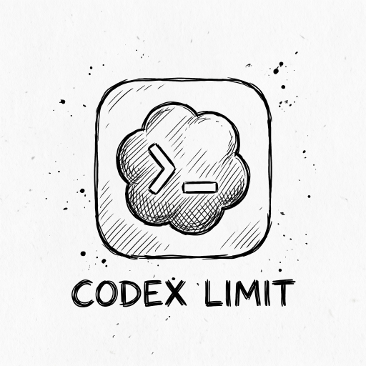

# Codex Limit Widget



Codex Limit Widget is a small macOS menu bar app with a WidgetKit widget for tracking Codex usage limits.

It reads your existing Codex Desktop login from `~/.codex/auth.json`, checks the read-only usage endpoints, then writes a sanitized local snapshot for the widget. The widget does not store your bearer token.

## Install

> **Warning:** GitHub release v0.1.0 is broken and outdated after extraction. Do not use it or its prebuilt zip.

Install from source instead:

1. Clone this repository and open a terminal at the project root.
2. Install Xcode with the macOS development tools.
3. Keep Codex Desktop installed and logged in on the same Mac.
4. Run `./script/build_and_run.sh run`.

The local Debug build is ad-hoc signed for this Mac. It is not Developer ID signed or notarized, and it is only for local use.

## Add the widget

1. Open the macOS widget gallery.
2. Search for `Codex Limit Widget`.
3. Choose the size you want and add it to the desktop or Notification Center.
4. Open the app once if the widget says it has not checked yet.

The app refreshes every minute. WidgetKit may update the visible widget a little slower when macOS throttles background refreshes.

## What it shows

- 5-hour usage remaining
- Weekly usage remaining
- Named model-specific usage limits when Codex returns them
- Flexible-credit balance, with banked resets as a legacy fallback
- Active model and reasoning effort from `~/.codex/config.toml`
- Next reset timing
- Last checked time
- Local auth, API, and snapshot errors when a check fails

## Build from source

Requirements:

- macOS 14 or newer
- Xcode with macOS development tools
- Swift toolchain
- Codex Desktop already logged in

Run the checks:

```sh
swift test --scratch-path /tmp/codex-limit-widget-test
swift build --scratch-path /tmp/codex-limit-widget-build
```

Build the app and widget:

```sh
xcodebuild -project "Codex Limit Widget.xcodeproj" -scheme "Codex Limit Widget" -configuration Debug -derivedDataPath /tmp/codex-limit-widget-derived build
```

The local build tool supports five modes:

```sh
./script/build_and_run.sh build
./script/build_and_run.sh run
./script/build_and_run.sh debug
./script/build_and_run.sh logs
./script/build_and_run.sh smoke
```

- `build` compiles without stopping or launching the app.
- `run` builds and launches the app.
- `debug` builds and starts the app in LLDB.
- `logs` builds, launches, and streams app logs.
- `smoke` builds, launches, and verifies a fresh sanitized widget snapshot without printing it.

Create a local preview zip with:

```sh
./script/package_local_preview.sh
```

The archive is written under `dist/` as `Codex-Limit-Widget-0.2.0-<architecture>-local-preview.zip`. It contains only the host architecture, uses an ad-hoc local signature rather than a distribution signature, is not notarized, and is for local use only. Release distribution still requires an Apple signing team, provisioning profiles, Developer ID signing, and notarization.

## Troubleshooting

If the widget does not show current values, open `Codex Limit Widget.app` once and wait for the first check. The app owns the Codex auth read and writes the snapshot the widget displays.

If the widget still shows old data, remove it from the desktop or Notification Center and add it again from the widget gallery.

If the app reports an auth error, open Codex Desktop and make sure you are signed in.
